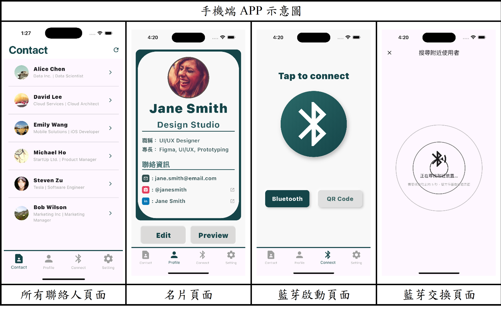

# XR Card - 智慧商務名片 App

**XR Card** 是一個基於 Flutter 開發的新世代數位名片應用程式。它結合了 **藍牙近場通訊 (BLE)**、**Supabase 雲端資料庫** 與 **Google Gemini 生成式 AI**，旨在解決傳統名片交換的痛點，並提供更深度的商務社交輔助。


## ✨ 核心功能 (Key Features)

* **📇 數位名片管理 (Digital Profile)**
    * 建立並編輯個人完整的商務檔案（職稱、公司、Email、電話）。
    * 整合多種社群連結（Social Links），一鍵導流。
    * 即時預覽名片樣式。

* **🤝 近場名片交換 (Nearby Exchange)**
    * 利用 **Bluetooth Low Energy (BLE)** 技術，自動偵測附近的 XR Card 使用者。
    * 無須掃描 QR Code 也能透過廣播 (Advertising) 與掃描 (Scanning) 機制發現彼此。
    * 支援發送交友邀請、接受或拒絕名片交換請求。

* **🤖 AI 商務助理 (AI-Powered Insights)**
    * 整合 **Google Gemini Pro** 模型。
    * **企業分析**：自動搜尋並彙整聯絡人公司的產業地位、主要業務與近期新聞。
    * **話題建議**：根據對方的職位、公司動態及過往對話紀錄，由 AI 生成合適的破冰開場白 (Ice Breakers)。

* **☁️ 雲端聯絡人簿 (Cloud Contacts)**
    * 使用 **Supabase** 作為後端，資料即時同步。
    * 安全儲存已交換的聯絡人資料，隨時隨地存取。

* **📷 XR/AR 擴增實境 (XR Features)**
    * 內建相機功能，支援未來擴充 XR 視覺化名片或 AR 互動體驗。

## 🛠️ 技術堆疊 (Tech Stack)

* **Framework:** [Flutter](https://flutter.dev/) (SDK ^3.8.1)
* **Backend & Auth:** [Supabase](https://supabase.com/)
* **AI Model:** [Google Generative AI (Gemini)](https://ai.google.dev/)
* **State Management:** Flutter Native (setState)
* **Key Packages:**
    * `supabase_flutter`: 後端連線與資料庫操作
    * `flutter_blue_plus` / `flutter_ble_peripheral`: 藍牙廣播與掃描
    * `google_generative_ai`: AI 生成服務
    * `mobile_scanner` / `qr_flutter`: QR Code 支援
    * `flutter_dotenv`: 環境變數管理

## 🚀 快速開始 (Getting Started)

### 1. 安裝依賴 (Install Dependencies)

請確保您已安裝 Flutter SDK，然後在專案根目錄執行：

```bash
flutter pub get
```

### 2. 設定環境變數 (Set Up Environment Variables)

本專案使用 flutter_dotenv 管理敏感資訊。請在專案根目錄建立一個 .env 檔案，並填入以下資訊（請替換為您的實際 Key）：

```
# Supabase 設定
SUPABASE_URL=your_supabase_url
SUPABASE_ANON_KEY=your_supabase_anon_key

# Google Gemini AI 設定
GEMINI_API_KEY=your_gemini_api_key
```
注意：請勿將 .env 檔案提交到版本控制系統 (Git)。

### 3. 執行應用程式 (Run the App)

```bash
flutter run
```

## 📂 專案結構 (Project Structure)

```
lib/
├── core/                # 核心共用元件 (Widgets, Theme)
├── data/                # 資料層 (Supabase Services, Models)
├── features/            # 主要功能模組
│   ├── connect/         # 藍牙連線與搜尋頁面
│   ├── contact/         # 聯絡人列表與詳情
│   ├── exchange/        # 名片交換邏輯
│   ├── profile/         # 個人檔案編輯與顯示
│   ├── setting/         # 設定頁面
│   └── xr_simulator/    # XR 模擬相關
├── services/            # 外部服務 (AI, Bluetooth, Google Search)
├── pages/               # 主要頁面導航 (HomePage)
└── main.dart            # 應用程式入口
```

## 📝 開發注意事項 (Notes)

* 權限管理：Android 與 iOS 需分別設定藍牙 (Bluetooth)、相機 (Camera) 與 定位 (Location) 權限。

* Supabase Schema：資料庫需配合 UserCompleteProfile 與 ContactRelationship 模型建立對應的 Table 與 RLS (Row Level Security) 規則。